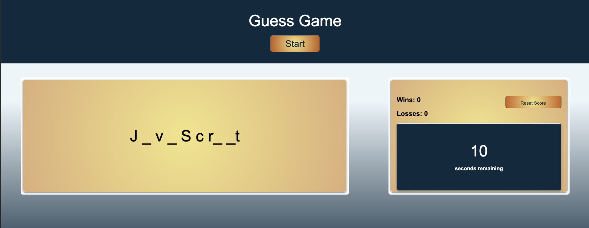

# guess_game_letters

## Table of Contents

- [Description](#description)
- [Installation](#installation)
- [Tools](#tools)
- [Specification](#Specification)
- [Contact](#contact)
- [License](#license)
- [Acknowledgements](#acknowledgements)

## Description

A game that is under time constrains and that requires the user to try and guess a word by filling in a number of blanks that match the number of letters in that word.

## Installation

- Clone the repo (please reference the links below).

```md
git@github.com:Kimberly-Rodriguez/guess_game_letters.git
```



[Application-Link](https://kimberly-rodriguez.github.io/guess_game_letters/)

## Tools

This application was built using JavaScript and Web APIs

## Specification

- When a user presses a letter key, the user's guess should be captured as a key event.

- When a user correctly guesses a letter, the corresponding blank "_" should be replaced by the letter. For example, if the user correctly selects "a", then "a _ _ a _" should appear.

- When a user wins or loses a game, a message should appear and the timer should stop.

- When a user clicks the start button, the timer should reset.

- When a user refreshes or returns to the brower page, the win and loss counts should persist.

## Contact

If you have any questions about my work OR wish to collaborate in the future please contact me via email: krodriguez.ucla@gmail.com OR feel free to connect via GitHub: [Kimberly-Rodriguez](https://github.com/Kimberly-Rodriguez).

## License

Licensed under the [MIT License](LICENSE).

## Acknowledgements

[UCLA Extension Coding Bootcamp](https://bootcamp.uclaextension.edu/coding/)
